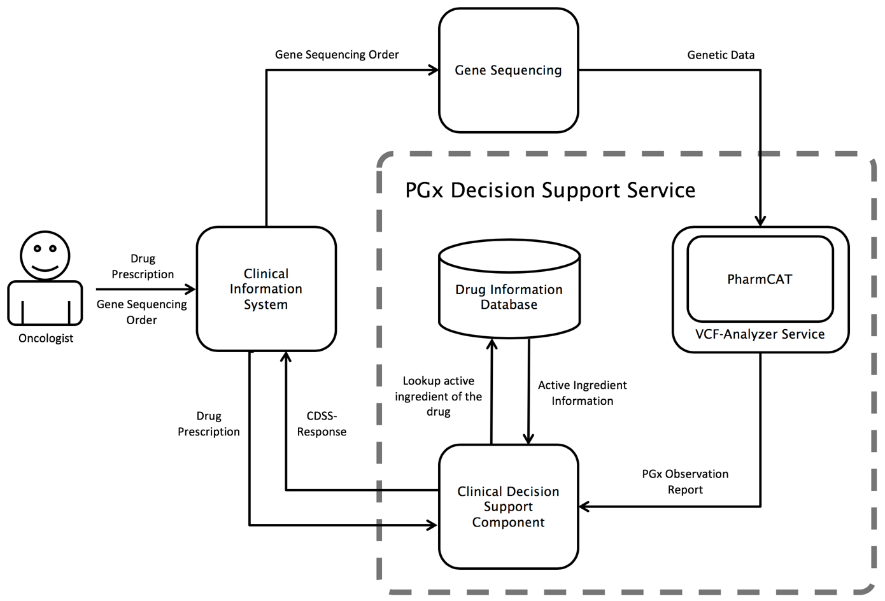

# PharmCatWrapper_CGM
This repository includes 3 central folders for embedding PharmCAT:
+ DemoApplication: Java frontend for using PGx guideline information that is extracted via PharmCAT
+ phoenix: The backend for the clinical information system CGM Phoenix (proprietary)
+ VCFAnalyzer: wrapper for PharmCAT that allows to parse HL7 messages

