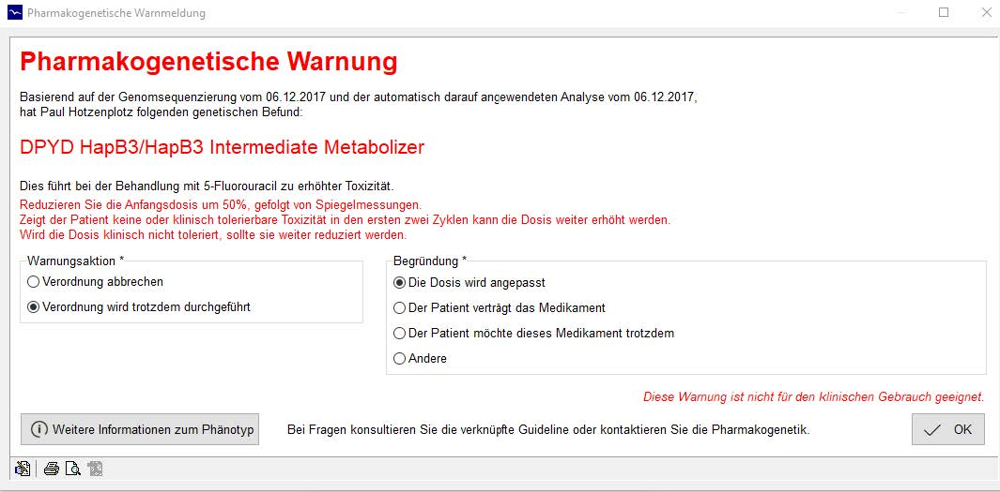

# PharmCatWrapper_CGM
This repository includes 3 central folders for embedding PharmCAT:
+ DemoApplication: Java frontend for using PGx guideline information that is extracted via PharmCAT
+ phoenix: The backend for the clinical information system CGM Phoenix (proprietary)
+ VCFAnalyzer: wrapper for PharmCAT that allows to parse HL7 messages

To use PharmCAT within our CIS eco system, the user (Oncologist) places a drug prescription and a gene sequencing order. The CIS pass the sequencing order to the sequencer and the prescription order to the CDSS component. As new genetic data is available, PharmCAT performs the annotation process and passes the pharmacogenetic observation report to the CDSS. The CDSS looks up the active ingredient of the drug in the drug information database. If there is a matching phenotype for the active ingredient in the PGx observation report, the CDSS generates a customized warning that is sent to the CIS. 

A warning message issued by our system

